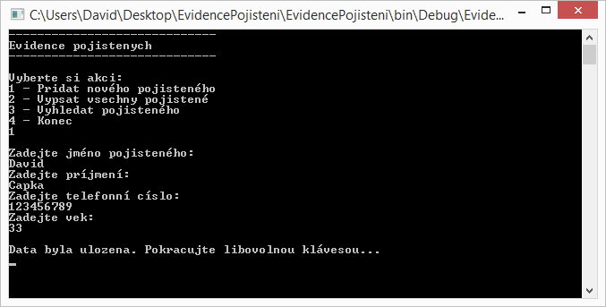
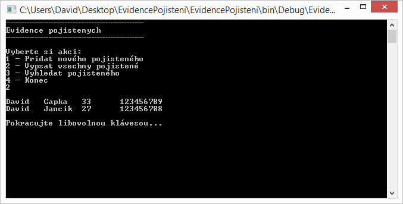
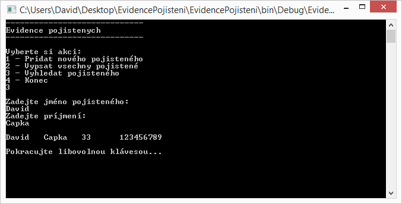

# Konzolová aplikace (Java)
/* http://www.itnetwork.cz */

## Zadání
Naprogramuj konzolovou aplikaci pro evidenci pojistných událostí. Před odevzdáním si zkontroluj, že tvůj kód odpovídá kritériím uvedeným v další záložce níže.

### Minimální požadavky ke splnění

- Aplikace obsahuje správu pojištěných (to jsou pojištěné osoby, např. "Jan Novák"):
  - Vytvoření pojištěného
    - Evidujte jméno, příjmení, věk a telefonní číslo
  - Zobrazení seznamu všech pojištěných
  - Vyhledání pojištěného podle jména a příjmení
- Dané entity jsou uloženy v kolekci v paměti
- Aplikace je naprogramována podle dobrých praktik
- Využívejte konstruktory pro inicializaci objektů
- toString() pro jejich výpis
- Oddělujte kód do samostatných tříd a souborů

Editaci a odstranění pojištěných ani ukládání dat po skončení aplikace není třeba řešit.

### Ukázkové obrazovky aplikace
### Přidání pojištěného:

### Výpis všech pojištěných:

### Vyhledání pojištěného:
